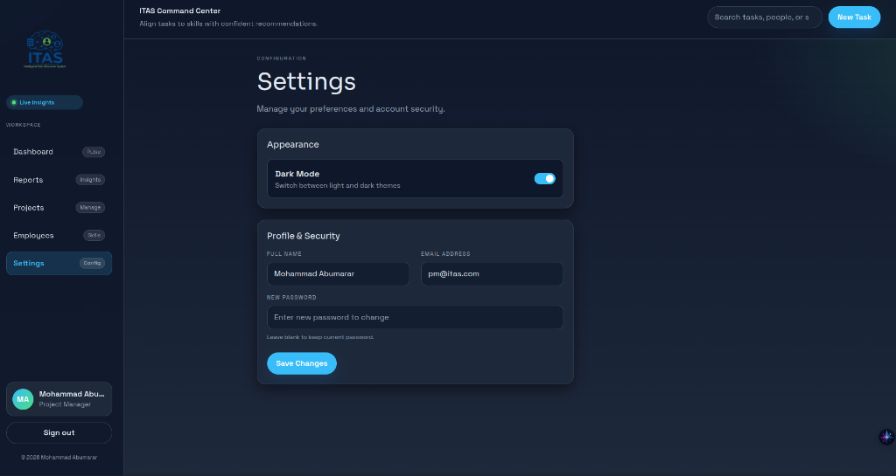

# Intelligent Task Allocation System (ITAS)

**Live Demo:** [https://www.jobtecacademy.com/](https://www.jobtecacademy.com/)


## Project Overview
ITAS is an enterprise-grade, web-based system designed to optimize software development task allocation within IT projects. It leverages AI-driven matching algorithms, Natural Language Processing (NLP) for CV analysis, and historical performance tracking to ensure data-driven, unbiased task assignments.

### 🌟 Recent Major Features
*   **Performance Task History Profile:** A dynamic, data-driven profile for each employee that tracks granular task-level execution. Project Managers can rate specific skills (1-5 scale) used in a task upon completion.
*   **Dynamic AI Matching Decay:** The AI Matching Engine no longer relies purely on static CV data. It dynamically adjusts employee skill profiles based on proven historical task evaluations, penalizing inconsistency and weighting recent tasks higher using an exponential time-decay function.
*   **Interactive Visual Analytics:** Integrated `recharts` to provide Project Managers with massive, interactive visualization modals featuring Skill Usage History, Rating Progress Bars, and chronological Performance Evolution line charts.

---

## 📸 Screenshots

| Dashboard | System Reports |
|:---:|:---:|
|  |  |

| Projects Portfolio | Employee Management |
|:---:|:---:|
|  |  |

| Employee Profile | Settings & Configurations |
|:---:|:---:|
|  |  |

---

## 🏛️ Architecture Overview

The system is built on a modern decoupled architecture:

*   **Frontend (Client Layer):** A responsive, single-page application built with React, TypeScript, and Vite. State is managed via Context API, and data fetching is optimized using React Query. Styling is handled via Tailwind CSS, and advanced data visualization is powered by `recharts`.
*   **Backend (API Layer):** A RESTful API built with Django and Django REST Framework (DRF). It handles business logic, JWT authentication, role-based access control (RBAC), atomic database transactions, and AI integrations.
*   **AI/ML Engine:** An embedded scikit-learn pipeline used to classify tasks, predict roles based on CV content, and calculate suitability scores by dynamically fusing task requirements, parsed CV skillsets, and granular real-world historical performance evaluations.
*   **Database:** PostgreSQL (with SQLite fallback for local dev) serving as the primary relational store. Redis is used for caching in production.

---

## 🚀 Environment Setup & Local Development

This project supports full-stack orchestration using Docker.

### Prerequisites
*   Docker & Docker Compose
*   Python 3.11+ (if running bare metal)
*   Node.js 18+ (if running bare metal)

### Method 1: Using Docker (Recommended)
1.  **Clone the repository:**
    ```bash
    git clone <repository-url>
    cd ITAS
    ```
2.  **Start the services:**
    ```bash
    docker-compose up --build
    ```
3.  **Access the application:**
    *   Frontend: `http://localhost:80`
    *   Backend API: `http://localhost:8000`
    *   Database: Postgres is exposed on port `5432`

### Method 2: Bare Metal Setup

#### Backend Setup
1.  Navigate to the backend directory: `cd itas-backend`
2.  Install dependencies: `pip install -r requirements.txt`
3.  Set up environment variables: Copy `.env.example` to `.env` and fill in the values.
4.  Run migrations: `python manage.py migrate`
5.  Start the server: `python manage.py runserver`

#### Frontend Setup
1.  Navigate to the frontend directory: `cd itas-frontend`
2.  Install dependencies: `npm install`
3.  Start the dev server: `npm run dev`

---

## 🔐 Environment Variables (.env)

| Variable | Description | Default |
| :--- | :--- | :--- |
| `SECRET_KEY` | Django Secret Key | (Required for Prod) |
| `DEBUG` | Enable debug mode | `False` |
| `DJANGO_SETTINGS_MODULE` | Settings file to use | `itas.settings.development` |
| `DATABASE_URL` | PostgreSQL Connection URI | (Falls back to SQLite) |
| `REDIS_URL` | Redis Connection URI | (Falls back to LocMem) |

---

## 📡 API Usage

The backend exposes a secure REST API. All endpoints (except login) require a Bearer token in the `Authorization` header.

### Authentication
*   `POST /api/auth/login/` - Authenticate user and receive JWT.
*   `GET /api/auth/profile/` - Get current user profile.

### Core Entities
*   `GET /api/projects/` - List projects (Scoped by role).
*   `GET /api/tasks/` - List tasks.
*   `POST /api/tasks/` - Create a new task and trigger AI matching.
*   `POST /api/tasks/{id}/rate-performance/` - PM endpoint to submit overall task ratings and granular per-skill evaluations.
*   `GET /api/employees/` - List employees.
*   `GET /api/employees/{id}/performance-profile/` - Fetch aggregated skill analytics, task history, and progression metrics.
*   `POST /api/employees/` - Create a new employee (PM only).

### AI & Operations
*   `POST /api/employees/analyze/` - Upload a CV (PDF/Docx) to extract skills and predict roles.
*   `GET /api/tasks/{id}/matches/` - Get AI-recommended employee matches factoring in historical performance.
*   `POST /api/tasks/{id}/assign/` - Assign a task to an employee.

---

## 🛳️ Deployment Guide

### CI/CD Pipeline
The repository includes a GitHub Actions workflow (`.github/workflows/main.yml`) that automatically runs backend unit tests (`pytest`), formats code (`black`, `isort`), and builds the React frontend on every push to the `main` branch.

### Production Deployment (Render + Vercel)
1.  **Database:** Provision a PostgreSQL instance (e.g., Supabase or Render DB).
2.  **Backend (Render):**
    *   Connect your repository to Render as a "Web Service".
    *   Set the Root Directory to `itas-backend`.
    *   Build Command: `pip install -r requirements.txt && python manage.py migrate`
    *   Start Command: `gunicorn itas.wsgi:application`
    *   Ensure `DJANGO_SETTINGS_MODULE=itas.settings.production` is set.
3.  **Frontend (Vercel):**
    *   Connect the repository to Vercel.
    *   Set the Root Directory to `itas-frontend`.
    *   Add the `VITE_API_BASE_URL` environment variable pointing to your deployed Render URL.

---

## 🛡️ Security Measures
*   **JWT Authentication:** Short-lived access tokens with HTTP-only refresh mechanisms.
*   **RBAC (Role-Based Access Control):** Granular permissions ensuring PMs can only manage their own projects/employees.
*   **Data Validation:** Strict serializers preventing injection attacks and ensuring data integrity.
*   **Security Headers:** Enabled CORS restrictions, CSRF protections, and HSTS in production.
