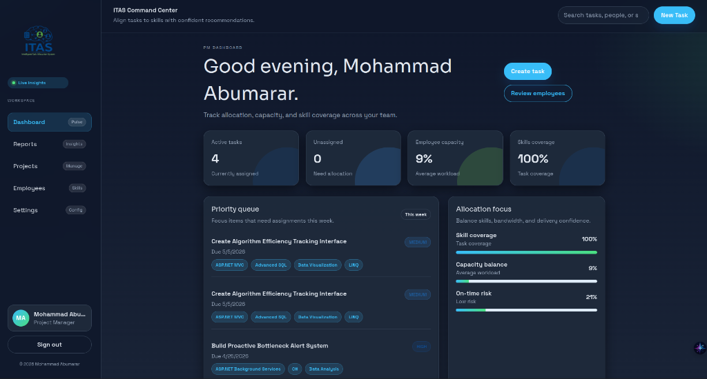
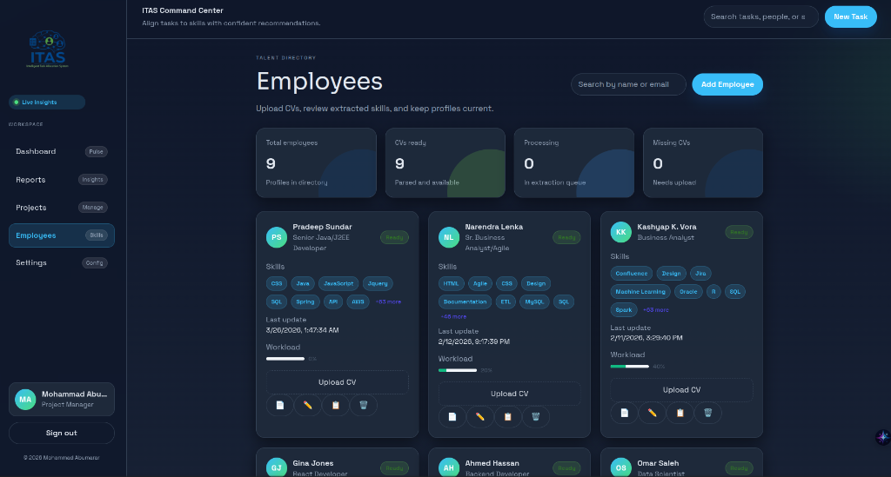
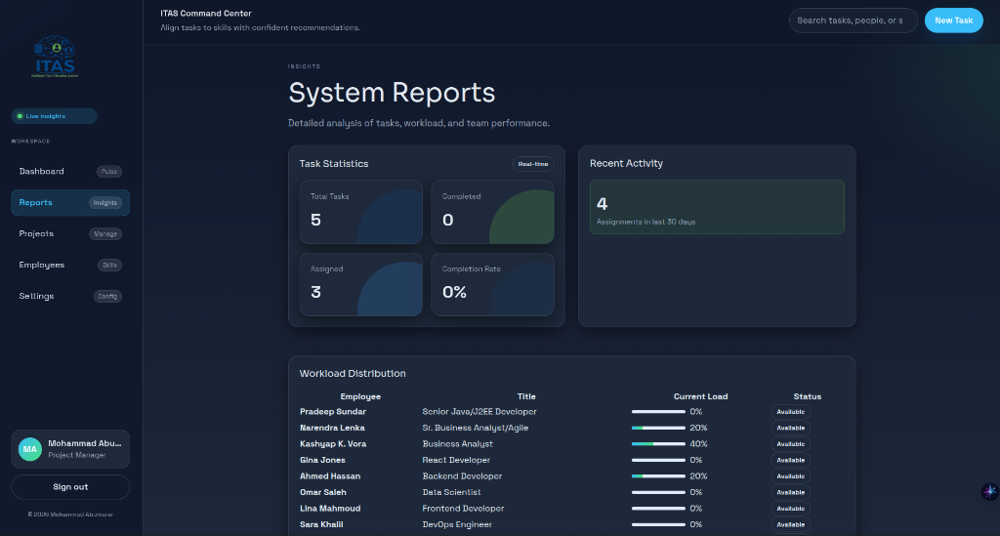
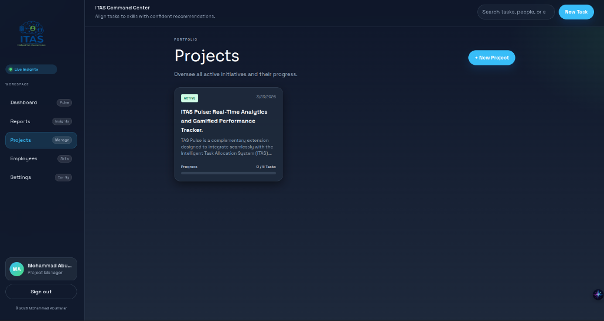
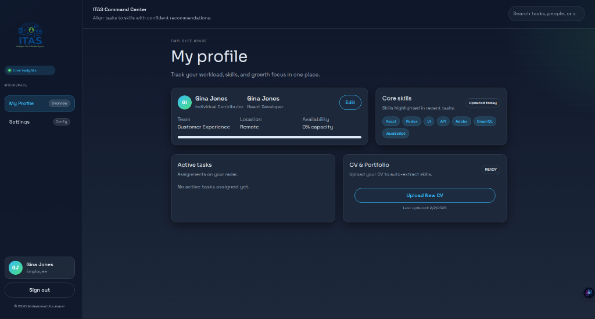
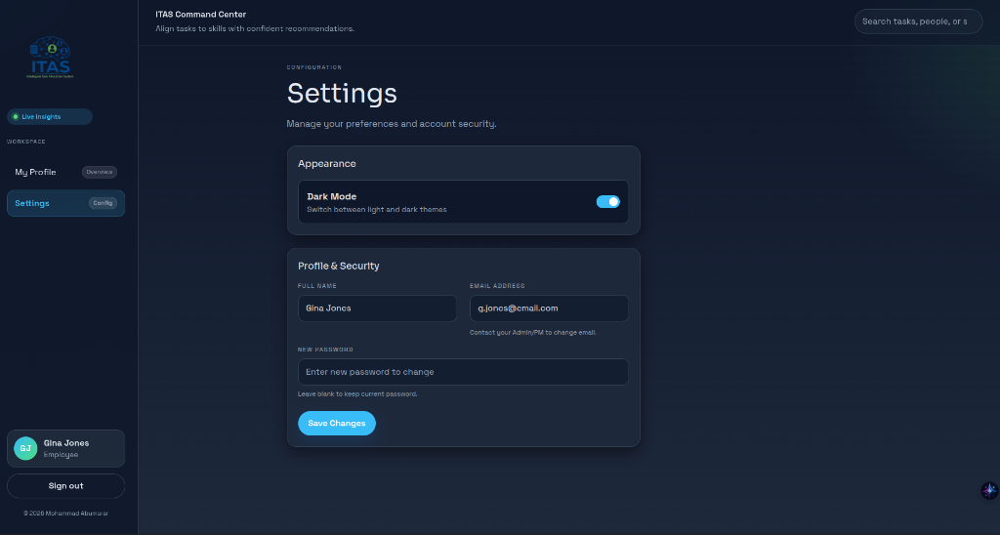

# Intelligent Task Allocation System (ITAS)


## Project Overview
ITAS is a web-based system designed to optimize software development task allocation within IT projects. It ensures fair, data-driven assignment by analyzing employees’ CVs and portfolios, matching them with task requirements.

## Problem Statement
- Manual task assignment is biased and inefficient.
- Project Managers often lack visibility into full team skill sets.
- Fresh graduates are often overlooked despite relevant skills.

## Proposed Solution
1. Employees upload CVs (PDF/Docx) and portfolio links (GitHub/Behance).  
2. NLP and RegEx parsing extract technical skills.  
3. Project Managers create tasks with skill tags.  
4. Matching engine calculates suitability scores for each employee.  
5. Dashboard visualizes workload and task progress.  
6. Feedback loop updates employee scores based on performance.

## Core Features
- **Profile Parser:** Extracts and analyzes CV and portfolio data.  
- **Task Manager:** Task creation and skill tagging.  
- **Matching Engine:** Calculates suitability scores with dual-stream logic for fresh vs senior employees.  
- **Dashboard:** Shows employee workload and task completion.  
- **Feedback Loop & Performance Rating:** Detailed PM feedback on completed tasks updates employee suitability scores dynamically.

## Visual Overview

### Project Manager Interface

#### PM Dashboard


#### Talent Directory (CV Parsing)


#### System Reports & Analytics


#### Project Portfolio


### Employee Interface

#### My Profile & Workload


#### Personal Settings


## Project Scope
**Included:**
- CV and portfolio parsing
- NLP-based skill identification
- Task creation with skill tags
- Algorithmic matching and scoring (incorporating past performance)
- Dashboard for project managers
- Employee profile management
- Detailed PM rating system for completed tasks

**Excluded:**
- Soft skills evaluation
- Full integration with external HR systems
- Real-time monitoring of coding performance
- Mobile application

## Technical Stack
- **Frontend:** React.js or Vue.js  
- **Backend:** Python (Django or Flask)  
- **Database:** PostgreSQL  
- **Text Processing:** PyPDF2, NLTK / spaCy

## Quick Start (Windows)

To get both the frontend and backend running locally on a Windows machine:

1. **Clone the repository:**
   ```cmd
   git clone <repository-url>
   cd "Intelligent Task Allocation System (ITAS)"
   ```

2. **Setup the Backend:**
   ```cmd
   cd itas-backend
   setup.bat
   ```
   *(This will create the virtual environment, install dependencies, and create the `.env` file.)*

3. **Start the Backend Server:**
   ```cmd
   :: Make sure your virtual environment is activated
   venv\Scripts\activate
   python manage.py runserver
   ```
   *(The API will be available at `http://localhost:8000/api/`)*

4. **Setup and Start the Frontend:**
   Open a new terminal window:
   ```cmd
   cd "Intelligent Task Allocation System (ITAS)\itas-frontend"
   npm install
   npm run dev
   ```
   *(The app will be available at `http://localhost:5173`)*

## References
- Jira Smart Assignment and Automation Tools  
- GitHub Projects & Actions  
- NLP-Based Applicant Tracking Systems (ATS)  
- Smart Hiring & CV Matching Systems  
- Competency Profiling & Skill Management Systems  
- [Scholar References](https://scholar.google.com/scholar?q=Coordinating+expertise+in+software+development+teams)
